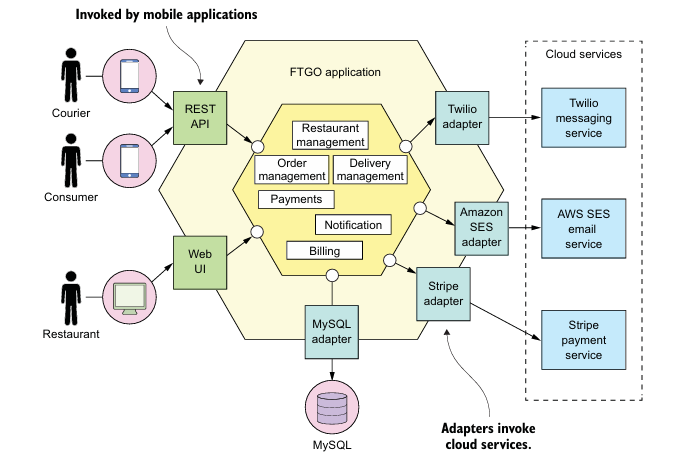
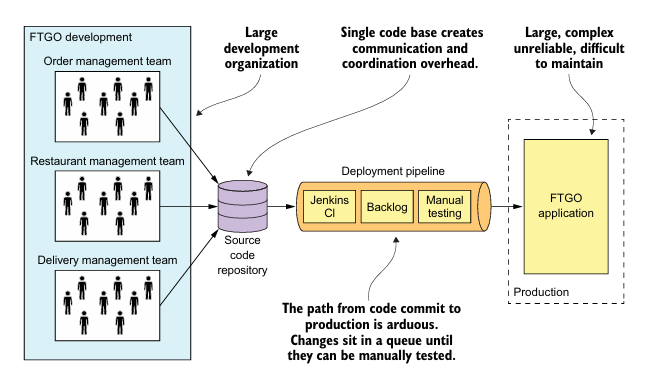

# 1.1 Monolithic Hell එකෙන් මිදීම (Escaping Monolithic Hell)

## පරිශීලකයින් වෙනුවෙන් ප්‍රවේශයක්

හායි දරුවෝ! අද අපි Software Engineering ක ලොකු ප්‍රශ්නයක් ගැන කතා කරමු. ඔයාලා වැඩ කරද්දී වෙන වෙලාවට ඔයාලගේ code එක මහ විශාල වෙලා handle කරන්න අමාරු වෙලා තියෙනවා නේද? ඔන්න ඒකයි **Monolithic Hell** කියන්නේ.

---

## 📚 මෙම පාඩමේ කලිනම (Chapter Overview)

මෙම පාඩම අවසන් වන විට ඔබට පහත දේවල් ගැන හොඳ වැටහීමක් ලැබෙනු ඇත:

✅ **Monolithic Hell යනු කුමක්ද සහ එයින් මිදෙන හැටි**  
✅ **Microservice Architecture එකේ ප්‍රධාන ගුණාංග සහ ඒකේ වාසි අවාසි**  
✅ **DevOps style development එක කරන්නේ කොහොමද**  
✅ **Microservice architecture pattern language එක ගැන මූලික දැනීම**

---

## 🎯 FTGO සමාගමේ කතාව

**Mary**, Food to Go Inc. (FTGO) හි CTO කෙනෙක්. ඇය software development conference එකකට ගිහින් microservices ගැන ඉගෙන ගෙන ආවා. ඒත් ඇයගේ සමාගමේ සත්‍ය තත්වය මුහුණපාන්නේ **Monolithic Hell** එකක්.

### 🔴 FTGO සමාගම මුහුණපාන ගැටලු:

1. **Release dates මිස් වීම** - නිරන්තරයෙන්ම deadline වලට software release කරන්න බෑ
2. **Development speed අඩු වීම** - Agile methodology use කරත් develop කරන්න ගොඩක් වෙලාව ගන්නවා
3. **Complex codebase** - Code එක එතරම් complex වෙලා තියෙනවා කියලා maintain කරන්න අමාරු

---

## 🏢 FTGO Application එකේ Architecture

### අපි මුලින්ම බලමු FTGO application එක කොහොමද design කරලා තියෙන්නේ:



### 🔍 මෙම Architecture එකේ ප්‍රධාන කොටස්:

1. **Hexagonal Architecture** - Business logic එක center එකේ තියෙනවා, වටේ adapters තියෙනවා
2. **Single WAR file** - සම්පූර්ණ application එකම package එකක bundle වෙලා තියෙනවා
3. **External integrations** - Stripe (payments), Twilio (messaging), AWS SES (email) වගේ services integrate වෙලා තියෙනවා

---

## ✅ Monolithic Architecture එකේ වාසි (Benefits)

### 🌟 මුල කාලයේ FTGO application එක සාර්ථක වන්න හේතු:

| වාසිය | විස්තරය | උදාහරණය |
|-------|---------|----------|
| **සරල Development** | IDE tools සහ development environment setup කරන්න ලේසි | Eclipse හෝ IntelliJ වගේ IDE එකක් use කරලා single project එකක්ම handle කරන්න පුළුවන් |
| **Radical Changes කරන්න ලේසි** | Database schema, code changes කරලා එකපාරටම deploy කරන්න පුළුවන් | User table එකට නව column එකක් add කරලා UI එකත් update කරන්න පුළුවන් |
| **Testing සරල** | End-to-end tests run කරන්න ලේසි | Selenium use කරලා full application එක test කරන්න පුළුවන් |
| **Deploy කරන්න ලේසි** | Single WAR file copy කරන්නම වෙන්නේ | Tomcat server එකට WAR file copy කරන්නම |
| **Scaling කරන්න පහසු** | Load balancer එක පිටුපස multiple instances run කරන්න පුළුවන් | 3-4 servers වලට same application copy කරන්න පුළුවන් |

### 💡 Real-world Example:
> **Startup company එකක්** කල්පනා කරන්න. ඔවුන්ට මුලින්ම simple e-commerce site එකක් ගොඩ නගන්න ඕනේ. Monolithic architecture use කරලා ඔවුන්ට quickly MVP (Minimum Viable Product) එකක් develop කරන්න පුළුවන්.

---

## ❌ Monolithic Hell - ගැටලුව මොකද්ද?

### 🚨 FTGO Application වර්ධනය වෙන්න වෙන්න මෙන්න මේ ගැටලු ආවා:

#### 1. **🤯 Complexity Intimidates Developers**

```
Application Size Growth:
Year 1: 10,000 lines of code ✅
Year 2: 50,000 lines of code ⚠️
Year 3: 200,000 lines of code ❌
Year 4: 500,000+ lines of code 💀
```

**ගැටලුව**: Developer කෙනෙකුට full application එක understand කරන්න බෑ වෙලා. Bug fix කරන්න හෝ new feature add කරන්න ගොඩක් වෙලාව ගන්නවා.

**Sri Lankan Example**: 
> Colombo වල traffic system එක වගේ. මුල ඉඳන් simple road network එකක් තිබුණා. ඒත් city එක expand වෙන්න වෙන්න road network එක complex වෙලා. දැන් new driver කෙනෙකුට Colombo එකේ navigate කරන්න අමාරුයි නේද?

#### 2. **🐌 Development is Slow**

| පරම්පරාගත Problems | Impact |
|-------------------|--------|
| **Large IDE Load** | IDE එක slow වෙනවා |
| **Long Build Times** | Build කරන්න 15-30 minutes |
| **Slow Startup** | Application start වෙන්න 5-10 minutes |
| **Edit-Build-Run-Test Loop** | Developer productivity අඩු වෙනවා |

#### 3. **🚀 Path from Commit to Deployment is Long**

**Current State**: Monthly deployment කරන්න පුළුවන් විතරයි  
**Industry Standard**: Daily හෝ hourly deployments  
**Amazon Example**: 2011 දී Amazon 11.6 seconds කට change එකක් deploy කරන්න පුළුවන් වුණා!

#### 4. **📈 Scaling is Difficult**

**Resource Conflicts**:
- **Restaurant Data**: RAM intensive (in-memory database)
- **Image Processing**: CPU intensive  
- **Video Streaming**: Network bandwidth intensive

**Problem**: Single application එකක් තියෙන නිසා different requirements වලට optimize කරන්න බෑ

#### 5. **🔥 Reliability Issues**

**Single Point of Failure**:
```
┌─────────────────────────────────────┐
│     Monolithic Application          │
│  ┌─────────┐ ┌─────────┐ ┌─────────┐│
│  │Module A │ │Module B │ │Module C ││
│  │(Normal) │ │(Memory  │ │(Normal) ││
│  │         │ │ Leak)   │ │         ││
│  └─────────┘ └────▼────┘ └─────────┘│
│                    │                │
│              ┌─────▼─────┐          │
│              │ENTIRE APP │          │
│              │  CRASHES  │          │
│              └───────────┘          │
└─────────────────────────────────────┘
```

**Real Example**: Memory leak Module B එකේ තිබුණත්, මුළු application එකම crash වෙනවා.

#### 6. **🔒 Technology Lock-in**

**Current FTGO Stack**:
- Java EE (outdated)
- Old version frameworks
- Legacy database drivers

**Problem**: New technology adopt කරන්න අමාරු. Full application එක rewrite කරන්න ඕනේ වෙනවා.

---

## 🎯 Sri Lankan Software Industry Examples

### **Example 1: E-commerce Platform**
```
ආරම්භක අවස්ථාව (Start):
- Simple online shop
- 100 products
- 5 developers
- Monthly updates

වර්තමාන තත්වය (Current):
- 50,000+ products  
- 25+ developers
- Daily requirement changes
- Deployment issues
```

### **Example 2: Banking Application**
```
මුල් System:
- Account management
- Basic transactions
- 2-3 modules

දැන් තිබෙන System:
- Online banking
- Mobile app
- Credit cards
- Loan management  
- Investment services
- 20+ integrated modules
```

---

## 📊 Performance Comparison



| Metric | Monolithic (Good Days) | Monolithic Hell | Target (Microservices) |
|--------|----------------------|-----------------|----------------------|
| **Build Time** | 2-5 minutes | 20-45 minutes | 5-15 minutes per service |
| **Deploy Time** | 10 minutes | 2-4 hours | 5-30 minutes |
| **Bug Fix Time** | 1-2 hours | 1-3 days | 2-8 hours |
| **Team Onboarding** | 1-2 days | 2-4 weeks | 3-7 days |
| **Release Frequency** | Weekly | Monthly/Quarterly | Daily/Hourly |

---

## 🧠 Key Takeaways (ප්‍රධාන කරුණු)

### ✨ **මතක තබා ගත යුතු කරුණු**:

1. **Monolithic Architecture** මුලින් හොඳයි ඒත් application වර්ධනය වෙනකොට ගැටලුකාරක වෙනවා
2. **Complexity** අධික වීම නිසා development speed අඩු වෙනවා
3. **Single point of failure** නිසා reliability issues ඇති වෙනවා  
4. **Technology lock-in** නිසා innovation අඩු වෙනවා
5. **Team scaling** අමාරු වෙනවා multiple teams එකම codebase එකේ වැඩ කරන්න

### 🎨 **Analogy (සමානතාවය)**:
> Monolithic application එකක් කියන්නේ **කොළඹ Fort railway station** එක වගේ. මුලින් simple station එකක් වුණත්, දැන් ගොඩක් complex වෙලා තියෙනවා. අලුත් platform add කරන්න හෝ renovate කරන්න ගිය වෙලාවට පුළුවන් මුළු traffic එකම disturb වෙන්න.

---

## 🤔 Self-Assessment Questions

1. **FTGO application එකේ main modules මොනවාද?**
2. **Monolithic hell එකේ symptoms 6 ක් කියන්න**
3. **Hexagonal architecture යනු කුමක්ද?**
4. **ඔබේ project එකක් monolithic hell එකට යනවාද කියලා identify කරන්නේ කොහොමද?**

---

## 📖 Next Chapter Preview

ඊළඟ පාඩමේදී අපි කතා කරමු **Microservices Architecture** ගැන. FTGO application එක කොහොමද microservices වලට convert කරන්නේ සහ එයින් ලැබෙන benefits මොනවාද කියලා.

---

## 📚 Additional Resources

- **Martin Fowler** ගේ Microservices articles
- **Building Microservices by Sam Newman**
- **Microservices Patterns by Chris Richardson**

---

*"හොඳ architect කෙනෙක් වෙන්න නම් monolithic hell එකේ symptoms හඳුනාගන්න දන්න ඕනේ. ඒකයි අපි මේ lesson එක ගොඩක් details වලින් කතා කලේ!"* - Software Architecture සරලව

**සටහන**: මෙම content එක university software engineering 2nd year students වෙනුවෙන් සිංහල භාෂාවෙන් සකස් කර ඇත.