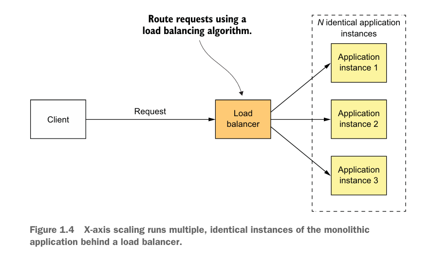
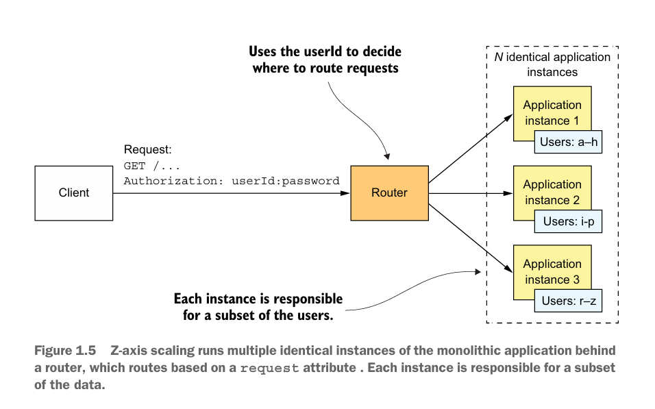
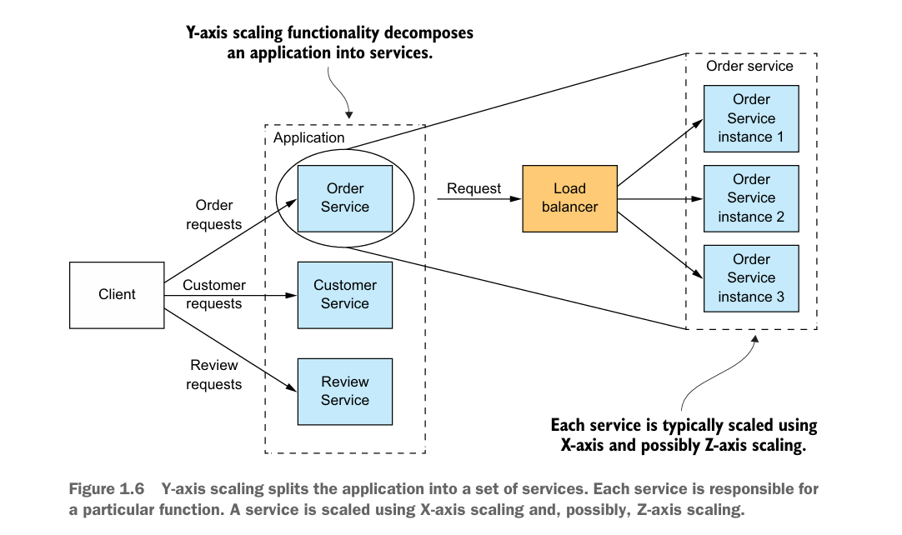

# 1.2 ඇයි අපිට Microservices අවශ්‍ය වෙන්නේ? "Monolithic Hell" එකෙන් ගැලවෙමු!

හිතන්න ඔයාලා ලොකු E-commerce (Amazon වගේ) application එකක් හදනවා කියලා. මුලින්ම අපි මේක එකම project එකක් විදියට හදන්න පටන් ගන්නවා. User registration, product management, shopping cart, payment gateway, order tracking... මේ හැමදේම තියෙන්නේ එකම codebase එකක. මේ වගේ application එකකට අපි කියනවා **Monolithic Application** කියලා.

හරියට මේක ලොකු අවුල් ජාලයක් වෙච්ච කුස්සියක් වගේ. එකම තැන කෑම උයනවා, බඩු හෝදනවා, එළවළු කපනවා, බිල් හදනවා. සූපවේදීන් (developers) 10ක් විතර එකට වැඩ කරද්දී එකිනෙකාට බාධා වෙනවා, වැඩේ අවුල් වෙනවා.

**Monolithic Architecture එකේ තියෙන ප්‍රධාන ගැටළු (Monolithic Hell):**

1.  **සංකීර්ණ වීම (Complexity):** Application එක ලොකු වෙන්න වෙන්න, එක developer කෙනෙක්ට සම්පූර්ණ පද්ධතියම තේරුම් ගන්න අමාරුයි.
2.  **තාක්ෂණය වෙනස් කිරීමේ අපහසුව (Obsolete Technology Stack):** මුලින් පාවිච්චි කරපු programming language එක (උදා: Java 8) හෝ framework (උදා: Spring 2) පරණ උනාම, සම්පූර්ණ application එකම අලුත් තාක්ෂණයට ගේන එක ගොඩක් අමාරුයි. හරියට පරණ කුස්සියක බඩු ඔක්කොම අයින් කරලා අලුතෙන්ම හදනවා වගේ.
3.  **කුඩා වෙනසකටත් සම්පූර්ණ පද්ධතියම Deploy කිරීම (Redeployment of the entire system):** Shopping cart එකේ පොඩි bug එකක් fix කරත්, සම්පූර්ණ application එකම compile කරලා, test කරලා, deploy කරන්න ඕන. මේකට ගොඩක් කාලය යනවා.
4.  **විශ්වසනීයත්වය අඩු වීම (Low Reliability):** එක තැනක (උදා: payment gateway) පොඩි දෝෂයක් ආවොත්, සම්පූර්ණ application එකම බිඳ වැටෙන්න පුළුවන්.
5.  **Scaling කිරීමේ අපහසුව:** හිතන්න අපේ site එකේ product search කරන කොටසට විතරක් traffic එක ගොඩක් වැඩියි කියලා. Monolith වලදී අපිට ඒ කොටස විතරක් බලවත් කරන්න (scale) බෑ. කරන්න වෙන්නේ මුළු application එකේම තව copy එකක් run කරන එක. ඒක හරියට කුස්සියේ එළවළු කපන කෙනාට වැඩ වැඩි උනාම, ඒ වගේම තව කුස්සියක් සම්පූර්ණයෙන්ම හදනවා වගේ වැඩක්.

මේ ප්‍රශ්න නිසා ලොකු applications නඩත්තු කරන එක "නිරයක්" (hell) වගේ වෙනවා. İşte මේකට විසඳුම තමයි Microservice Architecture.

## 2. Microservice Architecture: සංවිධානාත්මක කුස්සිය

Microservice කියන්නේ, අර ලොකු අවුල් ජාලයක් වෙච්ච කුස්සිය,  විශේෂිත කොටස් වලට වෙන් කරනවා වගේ වැඩක්.

*   එළවළු කපන්න වෙනම තැනක් (Service A - Product Catalog Service)
*   ග්‍රිල් කරන්න වෙනම තැනක් (Service B - Order Service)
*   බීම හදන්න වෙනම තැනක් (Service C - User Management Service)
*   බිල් දාන්න වෙනම තැනක් (Service D - Payment Service)

මේ හැම කොටසක්ම (service) ස්වාධීනයි. එකකට එකක් සම්බන්ධ වෙන්නේ නියමිත ක්‍රමවේදයකට (API - Application Programming Interface). හරියට කුස්සියේ එක එක station වල ඉන්න අය කතා කරගන්නවා වගේ.

**Microservice Architecture එකක ප්‍රධාන ලක්ෂණ:**

*   **කුඩා සහ විශේෂිත (Small and Focused):** සෑම service එකක්ම කරන්නේ එක නිශ්චිත කාර්යයක් විතරයි.
*   **ස්වාධීන (Autonomous):** එක service එකක් අනිත් ඒවාගෙන් ස්වාධීනව develop කරන්න, deploy කරන්න, සහ scale කරන්න පුළුවන්.
*   **තාක්ෂණික විවිධත්වය (Technology Heterogeneity):** User service එක Java වලින් හදද්දී, Product service එක NodeJS වලින් උනත් හදන්න පුළුවන්. මොකද ඒවා කතා කරන්නේ API හරහා.
*   **වඩා හොඳ විශ්වසනීයත්වය (Resilience):** එක service එකක් (උදා: Payment Service) වැඩ නොකලත්, application එකේ අනිත් කොටස් (Product Catalog, User login) දිගටම වැඩ කරනවා.

## 3. Scale Cube: Application එකක් Scale කරන ක්‍රම 3ක්

Application එකකට එන traffic එක වැඩිවෙද්දී, ඒක දරාගන්න පුළුවන් විදියට පද්ධතිය බලවත් කරන එකට අපි **Scaling** කියනවා. *The Art of Scalability* පොතේ එන **Scale Cube** කියන model එකෙන් මේක කරන ක්‍රම 3ක් අපිට පෙන්වනවා.

### a) X-axis Scaling (Horizontal Duplication)

මේක තමයි සරලම ක්‍රමය. හරියට අපේ application එකේම තව පිටපත් (identical copies) කිහිපයක් හදලා, Load Balancer එකක් හරහා එන requests ඒවට බෙදලා යවනවා.

*   **උදාහරණය:** අපේ e-commerce website එකට 1000ක traffic එකක් එනවා නම්, ඒ වගේම server තව 2ක් දාලා, එක server එකකට 333 ගානේ traffic එක බෙදනවා.
*   **සීමාව:** මේකෙන් application එකේ සංකීර්ණ බව (complexity) අඩු වෙන්නේ නෑ. Data ප්‍රමාණය වැඩිවෙද්දී මේ ක්‍රමය විතරක් මදි වෙනවා.

### b) Z-axis Scaling (Data Partitioning)

මේ ක්‍රමයේදීත් අපි application එකේ පිටපත් කිහිපයක් run කරනවා. නමුත්, එක එක පිටපත වග කියන්නේ data වලින් කොටසකට විතරයි.

*   **උදාහරණය:** අපේ e-commerce website එකේ users ලව රටවල් අනුව වෙන් කරනවා. Sri Lankan users ලගේ requests එක server එකකටත්, Indian users ලගේ requests තව server එකකටත් යොමු කරනවා. Router එකක් මගින් user ගේ attribute එකක් (උදා: `userId` හෝ රට) බලලා අදාල server එකට request එක යවනවා.
*   **සීමාව:** මේකෙනුත් application එකේ development complexity එක අඩු වෙන්නේ නෑ.

### c) Y-axis Scaling (Functional Decomposition) - **Microservices කියන්නේ මේක තමයි!**

Y-axis scaling කියන්නේ application එකේ කාර්යයන් (functions) අනුව එය කුඩා සේවාවන් (services) වලට කඩන එක.

*   **උදාහරණය:** අපේ e-commerce website එක `Order Service`, `Customer Service`, `Product Service` විදියට සේවා 3කට කඩනවා.
    *   Order සම්බන්ධ எல்லா requests යන්නේ **Order Service** එකට.
    *   Customer සම්බන්ධ எல்லா requests යන්නේ **Customer Service** එකට.
*   දැන් අපිට පුළුවන් `Product Service` එකට විතරක් traffic වැඩි නම්, ඒ service එකේ විතරක් X-axis scaling (copy කිහිපයක් හදන එක) කරන්න. අනිත් services වලට ඒක බලපාන්නේ නෑ.

**Microservice architecture කියන්නේ Y-axis scaling ක්‍රමයේ ප්‍රායෝගික (practical implementation) එකක්.**

## 4. Microservices කියන්නේ Modularity එකක්

ලොකු, සංකීර්ණ application එකක් හදද්දී, අපි ඒක  කොටස් (modules) වලට කඩනවා. Java වලදී නම් `packages` සහ `JAR files` වලින් මේක කරනවා. නමුත් Monolith වලදී, කාලයත් එක්ක මේ modules අතරේ තියෙන සීමා (boundaries) නැතිවෙලා, එකක් අනෙකට පටලැවිලා "spaghetti code" හැදෙනවා.

Microservice architecture එකේදී, **සෑම service එකක්ම ස්වාධීන module එකක්** විදියට ක්‍රියා කරනවා. ඒවට තියෙන API එක තමයි ඒ module එකේ සීමාව. ඒ සීමාව පහු කරලා code එකට access කරන්න බෑ. මේ නිසා application එකේ modularity එක දිගු කාලීනව ආරක්ෂා වෙනවා.

## සාරාංශය (Key Takeaways)

*   **Monolithic Architecture:** එකම codebase එකක තියෙන ලොකු application එකක්. නඩත්තු කරන්න, වෙනස් කරන්න, සහ scale කරන්න අමාරුයි.
*   **Microservice Architecture:** ලොකු application එකක්, , ස්වාධීන සේවාවන් (services) වලට කඩලා හදන එක.
*   **Microservices වල වාසි:** නඩත්තු කිරීමේ පහසුව, තාක්ෂණික නිදහස, ඉහළ විශ්වසනීයත්වය, සහ පහසුවෙන් scale කිරීමේ හැකියාව.
*   **Scale Cube:** Scaling කරන ක්‍රම 3ක් පෙන්වනවා:
    *   **X-axis:** තිරස්ව පිටපත් කිරීම (Horizontal duplication).
    *   **Z-axis:** දත්ත අනුව කොටස් කිරීම (Data partitioning).
    *   **Y-axis:** කාර්යයන් අනුව විභේදනය (Functional decomposition) - **මේක තමයි microservices!**

ඉදිරි පාඩම් වලදී අපි microservices හදන්නේ කොහොමද, services අතරේ data consistency තියාගන්නේ කොහොමද, test කරන්නේ කොහොමද වගේ දේවල් ගැන කතා කරමු.
