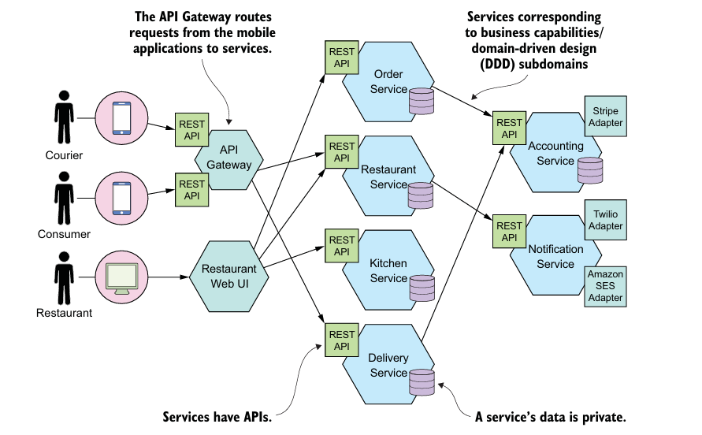
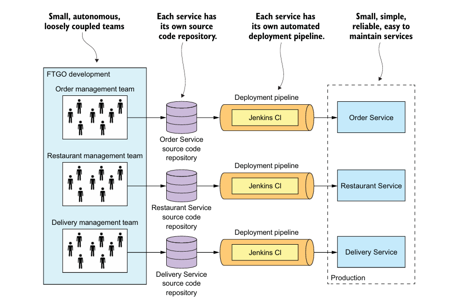

# 1.3: Microservice Architecture එකෙන් ගැලවීමක්

## Y-Axis Scaling: Application එක සේවාවන් වලට (Services) කැඩීම

හිතන්න අපේ Application එක හරියට ලොකු කේක් ගෙඩියක් වගේ කියලා. ගොඩක් අය කන්න එනකොට (high traffic) අපි මොකද කරන්නේ?

1.  **X-Axis Scaling (ක්ලෝන හදනවා):** තියෙන කේක් ගෙඩිය වගේම තව කේක් ගෙඩි ගොඩක් හදනවා. Monolithic app එකකදී වෙන්නේ මේක. සම්පූර්ණ app එකේම පිටපත් (instances) කිහිපයක් හදලා Load Balancer එකක් හරහා traffic එක බෙදලා දෙනවා. මේක සරල උනාට, app එකේ පොඩි කොටසකට විතරක් traffic එක වැඩි උනත්, සම්පූර්ණ app එකම copy කරන්න වෙන නිසා සම්පත් (resources) අපතේ යනවා.

2.  **Y-Axis Scaling (කෑලි වලට කඩනවා):** කේක් ගෙඩිය එක එක රස වලට අදාළව වෙනම කෑලි වලට කඩනවා. චොක්ලට් කෑල්ල, ස්ට්‍රෝබෙරි කෑල්ල, වැනිලා කෑල්ල වගේ. කවුරුහරි චොක්ලට් කන්න ආවොත් චොක්ලට් කෑල්ලක් දෙනවා. Microservices වලදී වෙන්නේ මේක. Application එකේ එක් එක් ක්‍රියාවන් (functionality) අනුව එයාව පොඩි පොඩි, ස්වාධීන සේවාවන් (services) වලට කඩනවා.

උදාහරණයක් විදිහට, Food To Go (FTGO) කියන app එකේ:
*   **Order Service:** ඇණවුම් කළමනාකරණය කරනවා.
*   **Customer Service:** පාරිභෝගිකයන්ගේ තොරතුරු තියාගන්නවා.
*   **Restaurant Service:** ආපනශාලා වල තොරතුරු තියාගන්නවා.

මේ විදිහට කඩපුවාම, Order Service එකට traffic එක වැඩි උනොත්, අපිට ඒ service එකේ විතරක් පිටපත් (instances) වැඩි කරගන්න පුළුවන්. සම්පූර්ණ app එකේම පිටපත් හදන්න ඕනේ නෑ. මේකෙන් සම්පත් ඉතුරු වෙනවා.

## Microservices කියන්නේ Modularity (ව්‍යුහගත බව) එකක්

ලොකු, සංකීර්ණ application එකක් හදනකොට, ඒක තේරුම් ගන්න පුළුවන් පොඩි පොඩි කොටස් වලට (modules) කඩන එක අත්‍යවශ්‍යයි.

*   **Monolith එකකදී:** මේ modules හැදෙන්නේ programming language එකේ තියෙන දේවල් වලින් (උදා: Java වල packages) සහ build files (උදා: JAR files) වලින්. හැබැයි කාලයක් යද්දී, එක module එකක ඉන්න developer කෙනෙක්ට පුළුවන් තව module එකක තියෙන class එකකට කෙලින්ම කතා කරන්න. නීති කඩන්න ලේසියි. ටික කලකින් මේක "අවුල් ජාලයක්" (Big Ball of Mud) බවට පත්වෙනවා.

*   **Microservices වලදී:** මෙතනදී module එක කියන්නේම **Service** එක. හැම service එකකටම එළියට පේන API (Application Programming Interface) එකක් තියෙනවා. හරියට ගෙදරක කාමර වගේ. හැම කාමරේකටම තියෙන්නේ එක දොරයි (API). කාමරේ ඇතුලට යන්න නම් ඒ දොරෙන් විතරයි යන්න පුළුවන්. බිත්ති කඩාගෙන යන්න බෑ. මේ නිසා, එක service එකකට තව service එකක අභ්‍යන්තර දේවල් වලට අතදාන්න බෑ. මේ නිසා කාලයක් ගියත් application එකේ ව්‍යුහගත බව (modularity) රැකිලා තියෙනවා.

## හැම Service එකකටම එයාගේම Database එකක්!

මේක Microservice වල තියෙන ගොඩක් වැදගත් සහ මුලදී තේරුම් ගන්න ටිකක් අමාරු සංකල්පයක්.

හිතන්න එකම office එකේ department දෙකක් (HR සහ Finance) එකම ෆයිල් කබඩ් එකක් පාවිච්චි කරනවා කියලා. Finance department එක කබඩ් එක ලොක් කරලා ගියොත්, HR department එකට වැඩ කරගන්න බෑ. ඒ දෙන්නා අතර ලොකු බැඳීමක් (tight coupling) තියෙනවා.

ඒත් department දෙකට වෙන වෙනම ෆයිල් කබඩ් දුන්නොත්? එයාලට අනිත් කෙනාගෙන් ස්වාධීනව වැඩ කරගන්න පුළුවන්. ඒ දෙන්නා අතර බැඳීම අඩුයි (loose coupling).

Microservices වලදීත් වෙන්නේ මේකමයි.
*   **Order Service** එකට එයාගේම database එකක් තියෙනවා (Orders table එක තියෙන).
*   **Customer Service** එකට එයාගේම database එකක් තියෙනවා (Customers table එක තියෙන).

**වාසි:**
1.  **ස්වාධීන සංවර්ධනය (Independent Development):** Order Service එකේ database schema එක වෙනස් කරන්න ඕන උනොත්, Customer Service එකේ developers ලගෙන් අහන්න ඕන නෑ. එයාලට එයාලගේ වැඩේ කරගෙන යන්න පුළුවන්.
2.  **වැරදි හුදකලා වීම (Fault Isolation):** Customer Service එකේ database එක lock උනත්, ඒක Order Service එකට බලපාන්නේ නෑ. පාරිභෝගිකයන්ට දිගටම ඇණවුම් කරන්න පුළුවන්.

> **වැදගත්:** හැම service එකකටම වෙනම database එකක් කිව්වම, ඒ හැම එකකටම වෙනම database server එකක් (උදා: Oracle license) ගන්න ඕන කියන එක නෙවෙයි. එකම database server එක ඇතුලේ වෙනම schemas විදිහට තියාගන්න පුළුවන්, එහෙමත් නැත්නම් එක service එකකට SQL database එකකුත්, තව එකකට NoSQL database එකකුත් වගේ විවිධ තාක්ෂණයන් උනත් පාවිච්චි කරන්න පුළුවන් (Polyglot Persistence).

## Microservices සහ SOA (Service-Oriented Architecture) අතර වෙනස

සමහරු කියනවා Microservices කියන්නේ අලුත් දෙයක් නෙවෙයි, පරණ SOA ම තමයි කියලා. යම් සමානකම් තිබුනත්, මේ දෙක අතර ලොකු වෙනස්කම් තියෙනවා.

| ගුණාංගය | SOA (Service-Oriented Architecture) | Microservices |
| :--- | :--- | :--- |
| **සන්නිවේදනය** | **Smart Pipes** (ESB - Enterprise Service Bus වගේ). මැද ඉන්න කෙනා (bus) ගොඩක් දේවල් දන්නවා, message එකේ logic එක වෙනස් කරන්නත් පුළුවන්. | **Dumb Pipes** (Message Broker, REST API). නිකන් තැපැල් කරුවා වගේ. ලියුම ඇතුලේ මොනවද තියෙන්නේ කියලා දන්නේ නෑ, ගිහින් දෙනවා විතරයි. |
| **දත්ත (Data)** | ගොඩක් වෙලාවට global data model එකක් සහ share කරගත්ත database එකක් තියෙන්නේ. | හැම service එකකටම එයාගේම database එකක් සහ data model එකක් තියෙනවා. |
| **Service ප්‍රමාණය** | සාමාන්‍යයෙන් ලොකු, Monolithic applications integrate කරන්න පාවිච්චි කරන නිසා services ලොකුයි. | Services ගොඩක් වෙලාවට පොඩියි, එක දෙයක් හරියට කරනවා. |
| **තාක්ෂණය** | SOAP, WS* වගේ බර (heavyweight) protocols. | REST, gRPC වගේ සැහැල්ලු (lightweight) protocols. |

## Microservice Architecture එකේ වාසි සහ අවාසි

ඕනෑම දෙයක් වගේම, Microservices වලත් වාසි වගේම අවාසිත් තියෙනවා.

### වාසි (Benefits)

1.  **බෙදාහැරීම සහ යෙදවීම (Continuous Delivery/Deployment):** ලොකු, සංකීර්ණ application එකක වුනත්, එක service එකක් වෙනස් කරලා, ඒක විතරක් deploy කරන්න පුළුවන්. සම්පූර්ණ app එකම deploy කරනකන් ඉන්න ඕන නෑ.
2.  **කුඩා සහ නඩත්තු කිරීමට පහසු වීම (Small and Easily Maintained):** එක service එකක් පොඩි නිසා, ඒක තේරුම් ගන්න, වෙනස්කම් කරන්න, වැරදි හදන්න ලේසියි.
3.  **ස්වාධීනව යෙදවිය හැකි වීම (Independently Deployable):** එක service එකක් deploy කරන එක අනිත් services වලට බලපාන්නේ නෑ.
4.  **ස්වාධීනව Scale කළ හැකි වීම (Independently Scalable):** වැඩිපුර traffic එන service එක විතරක් scale කරන්න (පිටපත් ගණන වැඩි කරන්න) පුළුවන්.
5.  **කණ්ඩායම් වලට ස්වාධීනව වැඩ කිරීමට හැකි වීම (Autonomous Teams):** එක service එකක් බලාගන්න වෙනම team එකකට පුළුවන්. එයාලට අනිත් teams වලින් ස්වාධීනව තීරණ අරන් වැඩ කරන්න පුළුවන්.
6.  **නව තාක්ෂණයන් පහසුවෙන් අත්හදා බැලීමට හැකි වීම (Easy to Adopt New Technologies):** එක service එකක් Java වලින් හදලා, තව service එකක් Python වලින් හදන්න පුළුවන්. අලුත් තාක්ෂණයක් ආවොත්, ඒක පොඩි service එකකට දාලා test කරලා බලන්න ලේසියි.
7.  **වැරදි හුදකලා වීම (Better Fault Isolation):** එක service එකක් crash උනත්, සම්පූර්ණ application එකම නවතින්නේ නෑ. අනිත් services දිගටම වැඩ.

### අවාසි (Drawbacks)

1.  **බෙදාහැරුණු පද්ධතියක සංකීර්ණත්වය (Distributed System Complexity):** දැන් අපිට තියෙන්නේ එක application එකක් නෙවෙයි, පොඩි applications ගොඩක්. මේ services එකිනෙකා එක්ක network එක හරහා කතා කරනකොට එන ප්‍රශ්න (network latency, fault tolerance) කළමනාකරණය කරන්න ඕන.
2.  **දත්තවල අනුකූලතාව (Data Consistency):** databases ගොඩක් තියෙන නිසා, ඒ හැම එකේම දත්ත එකම වෙලාවේදී update වෙලා තියෙනවා කියලා සහතික වෙන්න අමාරුයි. Eventual Consistency, Sagas වගේ සංකීර්ණ patterns පාවිච්චි කරන්න වෙනවා.
3.  **මෙහෙයුම්වල බර (Operational Overhead):** services ගොඩක් deploy කරන්න, monitor කරන්න, log කරන්න දියුණු DevOps (CI/CD) ක්‍රමවේදයක් ඕන.
4.  **පරීක්ෂා කිරීමේ අපහසුව (Testing Complexity):** එක functionality එකක් services කිහිපයක් හරහා යනවා නම්, ඒක end-to-end test කරන එක monolith එකක් test කරනවට වඩා සංකීර්ණයි.

## සාරාංශය (Summary)

*   Microservice architecture කියන්නේ ලොකු application එකක්, පොඩි, ස්වාධීන සේවාවන් (services) ගොඩකට කඩන ක්‍රමයක්.
*   මේකට Y-Axis scaling කියනවා.
*   හැම service එකක්ම එක නිශ්චිත කාර්යයක් කරන අතර, එයාටම අයිති database එකක් තියෙනවා.
*   Services එකිනෙකා එක්ක කතා කරන්නේ සැහැල්ලු (lightweight) API (REST, gRPC) හරහා.
*   මේකෙන් application එක නඩත්තු කරන්න, deploy කරන්න, scale කරන්න ලේසි වෙනවා.
*   නමුත්, මේකෙන් distributed systems වල තියෙන සංකීර්ණත්වය වැඩිවෙනවා.

Monolithic architecture එකෙන් පටන් අරන්, පස්සේ අවශ්‍යතාවය අනුව Microservices වලට යන එක ගොඩක් වෙලාවට හොඳ ප්‍රවේශයක්.
