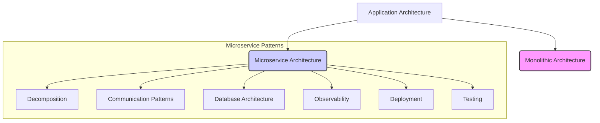

# Microservice Architecture Patterns (Microservice ගෘහ නිර්මාණ ශිල්පීය රටා)

## 1. Microservices කියන්නේ "Silver Bullet" එකක් නෙවෙයි!

Software Engineering වල "Silver Bullet" කියලා කියන්නේ, "හැම ප්‍රශ්නයකටම එකම විසඳුම" කියන අදහසට. සමහර අය හිතනවා අලුත් technology එකක් ආවම ඒකෙන් හැමදේම ලේසි වෙයි, productivity එක 10 ගුණයකින් වැඩිවෙයි කියලා. ඒත් ඇත්ත කතාව ඒක නෙවෙයි. Fred Brooks කියලා ප්‍රවීණයෙක් 1986 දීම කිව්වා "there are no silver bullets" කියලා.

Microservices කියන්නෙත් එහෙමයි. ඒක හැම project එකකටම, හැම application එකකටම ගැලපෙන්නේ නැහැ.

*   **Suck/Rock Dichotomy:** Software ලෝකේ සමහරු දේවල් දකින්නේ "සුපිරි" (rocks) නැත්නම් "අසාර්ථක" (sucks) විදියට විතරයි. ඒත් ඇත්ත තත්වේ ඊට වඩා සංකීර්ණයි. හැම තාක්ෂණයකම වාසි (pros) සහ අවාසි (cons) තියෙනවා.
*   **Gartner Hype Cycle:** අලුත් technology එකක් ආවම, මුලින්ම මිනිස්සු ඒ ගැන ලොකු බලාපොරොත්තු තියාගන්නවා (Peak of Inflated Expectations). පස්සේ ඒකේ අඩුපාඩු තේරෙද්දී ඒක වැඩක් නෑ කියලා හිතනවා (Trough of Disillusionment). අන්තිමට තමයි, ඒක ඇත්තටම ගැලපෙන්නේ මොන වගේ දේවල් වලටද, ඒකේ වාසි අවාසි මොනවද කියලා තේරුම් අරගෙන හරියට පාවිච්චි කරන්න ගන්නේ (Plateau of Productivity).

> **සරල උදාහරණයක්:**
> හිතන්න ඔයාට ගෙදර ඉඳන් කඩේට යන්න ඕන. ඔයාට පුළුවන් පයින් යන්න, බයිසිකලෙන් යන්න, කාර් එකෙන් යන්න, නැත්නම් ලොකු ට්‍රක් එකකින් යන්න. මේ හැම එකකටම වාසි අවාසි තියෙනවා.
> *   **Monolith:** ලොකු ට්‍රක් එකක් වගේ. ගොඩක් බඩු එකපාර අදින්න පුළුවන්, ඒත් නඩත්තුව වැඩියි, හැම ගමනකටම ගැලපෙන්නේ නෑ.
> *   **Microservices:** බයිසිකල්, කාර් වගේ පොඩි වාහන ගොඩක් වගේ. එක එක ගමනට ගැලපෙන වාහනයක් තෝරගන්න පුළුවන්. හැබැයි වාහන ගොඩක් කළමනාකරණය කරන එකත් අභියෝගයක්.
>
> **නිගමනය:** Microservice architecture එක හැමවිටම හොඳම විසඳුම නෙවෙයි, ඒ වගේම හැමවිටම නරකම විසඳුමත් නෙවෙයි. ඒක "It depends" (තත්වය මත රඳා පවතී) කියන තැන තමයි තියෙන්නේ.

---

## 2. Patterns සහ Pattern Languages (රටා සහ රටා භාෂා)

Software හදද්දී අපිට එකම වගේ ප්‍රශ්න ආයෙ ආයෙත් එනවා. "Pattern" එකක් කියන්නේ, යම් (context) එකකදී නැවත නැවත එන ප්‍රශ්නයකට (problem) නැවත නැවත පාවිච්චි කරන්න පුළුවන් විසඳුමකට (solution).

මේ අදහස මුලින්ම එන්නේ ගොඩනැගිලි නිර්මාණ ශිල්පයෙන් (real-world architecture). Christopher Alexander කියන කෙනා තමයි මේක හඳුන්වලා දුන්නේ.

> **සරල උදාහරණයක් (Cookbook Analogy):**
> *   **Pattern:** හොඳ "Chicken Curry" එකක් හදන recipe එක වගේ. ඒකේ තියෙනවා මොන වගේ වෙලාවකද (context) මේක හදන්නේ, මොනවද අවශ්‍ය ද්‍රව්‍ය (forces), කොහොමද හදන්නේ (solution), සහ හදලා ඉවර වුණාම මොනවද ප්‍රතිඵල (resulting context) කියලා.
> *   **Pattern Language:** සම්පූර්ණ "Cookbook" එක වගේ. ඒකේ එක එක recipe (patterns) තියෙනවා. ඒ වගේම, එක recipe එකක් තව එකකට සම්බන්ධ වෙන්නේ කොහොමද කියලත් තියෙනවා. (උදා: "Chicken Curry" recipe එකට, "කිරිබත්" recipe එක ගැලපෙනවා).

Software වලදී, මේ pattern එකක ගොඩක් වැදගත් කොටස් 3ක් තියෙනවා:

1.  **Forces (බලපෑම්):**
    මේ කියන්නේ, ප්‍රශ්නයක් විසඳන්න යද්දී අපි සලකා බලන්න ඕන දේවල්/අභියෝග. සමහර වෙලාවට මේ බලපෑම් එකිනෙකට පරස්පර වෙන්න පුළුවන්.
    *   **උදාහරණය:** Code එකක් ලියද්දී, ඒක තේරුම් ගන්න ලේසි වෙන්නත් ඕන (easy to understand), ඒ වගේම වේගවත්ව වැඩ කරන්නත් ඕන (good performance). සමහර වෙලාවට performance වැඩි කරන්න ලියන code එක තේරුම් ගන්න අමාරු වෙන්න පුළුවන්. මෙතනදි අපි තෝරාගැනීමක් කරන්න ඕන.

2.  **Resulting Context (ප්‍රතිඵලයක් ලෙස ලැබෙන තත්වය):**
    Pattern එකක් (විසඳුමක්) implement කළාට පස්සේ මොකද වෙන්නේ?
    *   **Benefits (වාසි):** විසඳුන ප්‍රශ්න මොනවද?
    *   **Drawbacks (අවාසි):** මේ විසඳුම නිසා ඇතිවුණ අවාසි හෝ විසඳන්න බැරිවුණ ප්‍රශ්න මොනවද?
    *   **Issues (නව ගැටළු):** මේ විසඳුම නිසා අලුතෙන් ඇතිවුණ ප්‍රශ්න මොනවද? (උදා: Microservice වලට යද්දී, service discovery, security වගේ අලුත් ප්‍රශ්න එනවා).

3.  **Related Patterns (සම්බන්ධිත රටා):**
    එක pattern එකක් තව එකකට සම්බන්ධ වෙන්නේ කොහොමද?
    *   **Predecessor (පූර්වගාමියා):** මේ pattern එක අවශ්‍ය වෙන්න හේතු වුණ pattern එක. (උදා: `Microservice Architecture` pattern එක තෝරාගත්ත නිසා, අපිට `Service Discovery` pattern එකක් අවශ්‍ය වෙනවා).
    *   **Successor (අනුප්‍රාප්තිකයා):** මේ pattern එක implement කළාම අලුතෙන් එන ප්‍රශ්න විසඳන pattern එක.
    *   **Alternative (විකල්ප):** එකම ප්‍රශ්නෙට තියෙන වෙනත් විසඳුමක්. (උදා: `Monolithic` සහ `Microservice` කියන්නේ alternative දෙකක්).
    *   **Generalization/Specialization:** එක pattern එකක් තව එකක විශේෂ අවස්ථාවක් හෝ සාමාන්‍යකරණයක් වීම.

---

## 3. Microservice Architecture Pattern Language එකේ දළ විශ්ලේෂණයක්

මේක හරියට Microservice වලින් application එකක් හදද්දී පාවිච්චි කරන්න පුළුවන් ලොකු "සිතියමක්" (map) වගේ. මේකේ තියෙනවා ඔයාට එන ප්‍රශ්න මොනවද, ඒවට තියෙන විසඳුම් (patterns) මොනවද, සහ ඒ විසඳුම් එකිනෙකට සම්බන්ධ වෙන්නේ කොහොමද කියලා.

පහත diagram එකෙන් ඒක සරලව පෙන්නනවා:

**Diagram එකේ පැහැදිලි කිරීම:**

1.  **Application Architecture:** මුලින්ම ඔයා තීරණය කරන්න ඕන Monolithic ද Microservice ද කියලා.
2.  **Microservice Architecture තෝරාගත්තොත්:** ඔයාට අලුත් ප්‍රශ්න ගොඩකට මුහුණ දෙන්න වෙනවා. Pattern language එකේ ඉතුරු කොටස් වලින් ඒ ප්‍රශ්න වලට විසඳුම් දෙනවා.
    *   **Decomposition:** ලොකු system එකක් පොඩි services වලට කඩන්නේ කොහොමද?
    *   **Communication Patterns:** මේ services එකිනෙකා එක්ක කතා කරන්නේ කොහොමද? (REST API? Messaging?)
    *   **Database Architecture:** හැම service එකකටම වෙනම database එකක් ද? නැත්නම් data කළමනාකරණය කරන්නේ කොහොමද?
    *   **Observability:** system එකේ මොකද වෙන්නේ කියලා බලාගන්නේ කොහොමද? (Logging, Monitoring)
    *   **Deployment:** මේ services deploy කරන්නේ කොහොමද? (Containers? Docker?)
    *   **Testing:** මේ වගේ බෙදාහැරුණු (distributed) system එකක් test කරන්නේ කොහොමද?

---

## සාරාංශය (Summary) - මතක තබාගත යුතු කරුණු

*   **Microservice Architecture** කියන්නේ ලොකු application එකක්, එකිනෙකින් ස්වාධීන, කුඩා සේවාවන් (services) වලට කඩා නිර්මාණය කිරීමේ ක්‍රමයක්.
*   Microservices කියන්නේ **"Silver Bullet" එකක් නෙවෙයි**. එය සෑම ව්‍යාපෘතියකටම සුදුසු නැහැ. එහි වාසි මෙන්ම අවාසි ද තිබෙනවා.
*   **Pattern** එකක් යනු යම් context එකකදී නැවත නැවත එන ප්‍රශ්නයකට ඇති, නැවත භාවිත කළ හැකි විසඳුමක්.
*   **Pattern Language** එකක් යනු යම් domain එකක ඇති ප්‍රශ්න විසඳීම සඳහා එකිනෙකට සම්බන්ධ වූ patterns එකතුවක්. (ඒක හරියට map එකක් වගේ).
*   Pattern එකක් විස්තර කරද්දී එහි **Forces** (විසඳිය යුතු ගැටළු), **Resulting Context** (විසඳුමේ වාසි, අවාසි, සහ නව ගැටළු) සහ **Related Patterns** (වෙනත් patterns වලට ඇති සම්බන්ධය) ගැන සැලකිලිමත් වීම ඉතා වැදගත්.
*   Microservice Pattern Language එක, Microservice architecture එකක් සාර්ථකව නිර්මාණය කිරීමට අවශ්‍ය මගපෙන්වීම ලබා දෙනවා.
