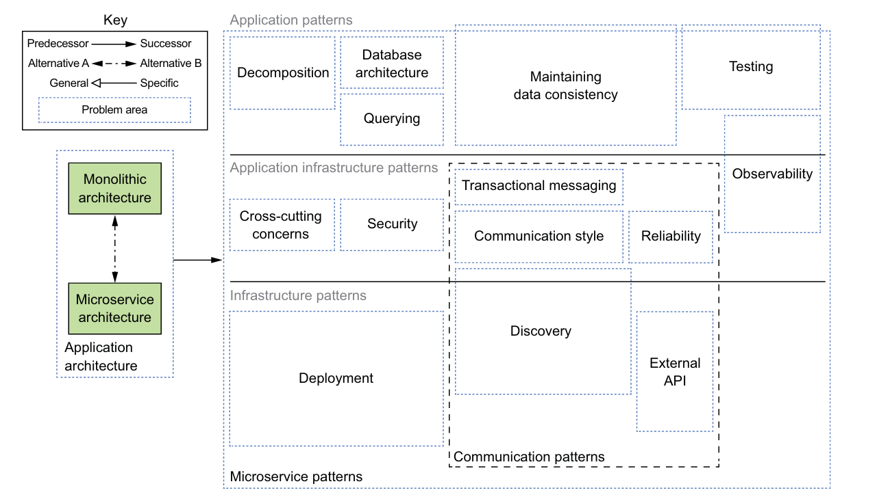

# 1.5 - Microservice ගෘහ නිර්මාණ ශිල්පීය රටා භාෂාව (Microservice Architecture Pattern Language) පිළිබඳ දළ විශ්ලේෂණයක්

## හැඳින්වීම

"Pattern Language" (රටා භාෂාව) කිව්වම programming language එකක් කියලා හිතන්න එපා. මේක හරියට පළපුරුදු කෙනෙක් ලියපු "cookbook" එකක් වගේ. Software system එකක් design කරද්දී අපිට නිතරම හමුවෙන ගැටළු (problems) සහ ඒවට පිළිගත්, සාර්ථක විසඳුම් (solutions) එකතු කරලා හදපු එකතුවක් තමයි "Pattern Language" එකක් කියන්නේ.

Microservice Pattern Language එක කියන්නේ, application එකක් microservices විදිහට හදද්දී අපිට එන challenges වලට විසඳුම් දෙන patterns එකතුවක්.

## Pattern Language එකේ ව්‍යුහය (Structure)

මේ pattern language එකේ ප්‍රධාන අරමුණු දෙකක් තියෙනවා:
1.  **Microservice Architecture එක ඔයාගේ application එකට අවශ්‍යද කියලා තීරණය කරන්න උදව් කරන එක.**
2.  **Microservice Architecture එක තෝරගත්තොත්, ඒක සාර්ථකව implement කරන්න උදව් කරන එක.**

රූප සටහන අනුව, මේ pattern language එක කොටස් කිහිපයකට බෙදෙනවා. ඒකෙ වම් පැත්තේ තියෙන්නේ ප්‍රධානම කොටස.

#### යෙදුම් ගෘහ නිර්මාණ ශිල්පීය රටා (Application Architecture Patterns)

මෙතනදි ඔයා මුලින්ම තෝරගන්න ඕන ඔයාගෙ application එක හදන්නෙ කොයි විදිහටද කියලා.
*   **Monolithic Architecture:** හැමදේම එකට තියෙන, එකම unit එකක් විදිහට deploy කරන ක්‍රමය.
*   **Microservice Architecture:** Application එක පොඩි පොඩි, ස්වාධීන සේවා (services) වලට කඩලා හදන ක්‍රමය.

මේ දෙකේ වාසි සහ අවාසි සලකා බලලා තමයි ඔයා තීරණයක් ගන්න ඕන.

### Microservices තෝරාගත්තොත් මුහුණදෙන ගැටළු සහ විසඳුම්

ඔයා Microservice Architecture එක තෝරගත්තොත්, ඔයාට අලුත් ප්‍රශ්න ගොඩකට මුහුණ දෙන්න වෙනවා. Pattern language එකේ ඉතුරු කොටස් වලින් ඒ ප්‍රශ්න වලට විසඳුම් දෙනවා. මේවා ස්ථර (layers) තුනකට බෙදෙනවා:

1.  **යෙදුම් රටා (Application Patterns):** මේවා කෙලින්ම developers ලට මුහුණ දෙන්න වෙන ප්‍රශ්න.
    *   **Decomposition (වෙන් කිරීම):** System එක පොඩි services වලට කඩන්නේ කොහොමද?
    *   **Database Architecture:** හැම service එකකටම වෙනම database එකක් දෙනවද? එහෙම නැත්නම් database management කරන්නේ කොහොමද?
    *   **Querying:** Services කිහිපයක තියෙන data එකතු කරලා query කරන්නේ කොහොමද?
    *   **Data Consistency:** Services ගොඩක් හරහා data වල ඒකාකාරී බව (consistency) පවත්වාගන්නේ කොහොමද?

2.  **යෙදුම් යටිතල ව්‍යුහ රටා (Application Infrastructure Patterns):** මේවා infrastructure සම්බන්ධ උනත්, developers ලටත් බලපාන ප්‍රශ්න.
    *   **Observability:** System එකේ මොනවද වෙන්නේ කියලා බලාගන්නේ (monitor කරන්නේ) කොහොමද? (Logging, Metrics, Tracing)
    *   **Security:** Services අතර communication සහ user authentication/authorization ආරක්ෂා කරන්නේ කොහොමද?
    *   **Communication Style:** Services එකිනෙකා සමඟ කතා කරන්නේ කොහොමද? (Synchronous/Asynchronous)

3.  **යටිතල ව්‍යුහ රටා (Infrastructure Patterns):** මේවා ගොඩක් වෙලාවට development වලින් එහාට ගිය, infrastructure සම්බන්ධ ප්‍රශ්න.
    *   **Deployment:** මේ පොඩි පොඩි services ගොඩ deploy කරන්නේ කොහොමද?
    *   **Service Discovery:** එක service එකක් අනිත් service එක තියෙන්නේ කොහෙද කියලා හොයාගන්නේ කොහොමද?
    *   **External API:** පිටතින් එන requests (e.g., from a mobile app) මේ services වලට යොමු කරන්නේ කොහොමද? (API Gateway)

### Application එක Services වලට වෙන් කිරීම (Decomposition)

Microservices හදද්දී තියෙන ලොකුම challenge එකක් තමයි system එක හරියට services වලට කඩාගන්න එක. මේකට උදව්වෙන ප්‍රධාන patterns දෙකක් තියෙනවා:

1.  **Decompose by Business Capability:** ආයතනයේ ව්‍යාපාරික හැකියාවන් (e.g., Order Management, Inventory Management, Customer Management) අනුව services වෙන් කිරීම.
2.  **Decompose by Subdomain:** Domain-Driven Design (DDD) වල එන subdomains අනුව services වෙන් කිරීම.

මේවා ගැන අපි ඊළඟ පාඩම් වලදී ගැඹුරින් කතා කරනවා.

## සාරාංශය (Summary)

*   **Microservice Pattern Language** කියන්නේ microservices හදද්දී එන ප්‍රශ්න වලට තියෙන විසඳුම් එකතුවක්.
*   මුලින්ම **Monolithic ද Microservice ද** කියලා තෝරගන්න ඕන.
*   Microservices තෝරගත්තොත් **Decomposition, Database Management, Communication** වගේ ගොඩක් දේවල් ගැන හිතන්න වෙනවා.
*   මේ patterns **Application, Application Infrastructure, සහ Infrastructure** කියන ස්ථර (layers) වලට බෙදලා තියෙනවා.
*   System එකක් services වලට කඩාගන්න එක (Decomposition) ඉතාම වැදගත් පියවරක්.
