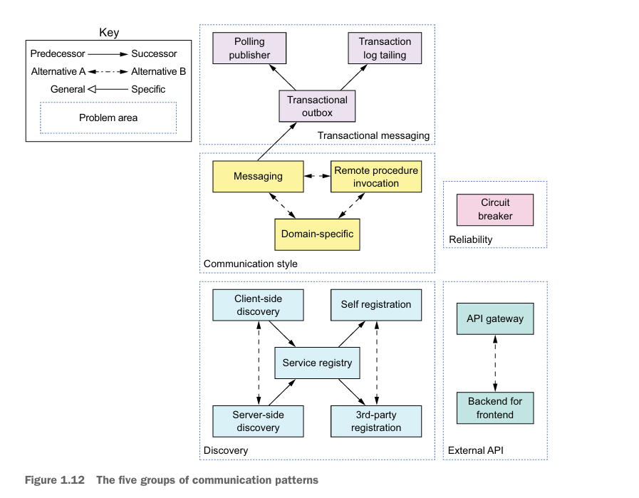
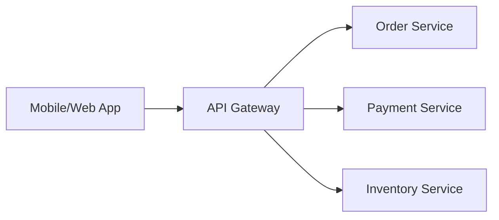
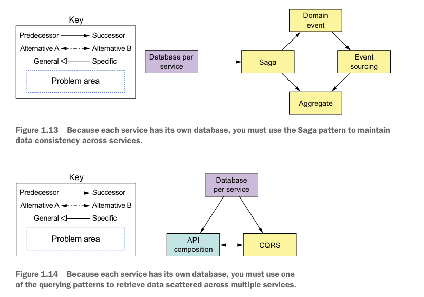
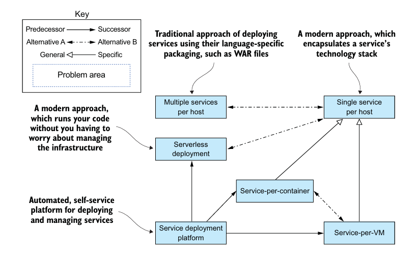
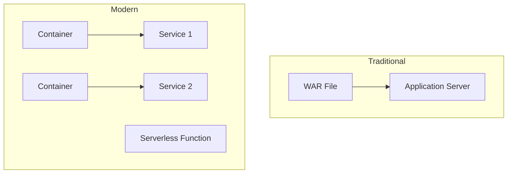
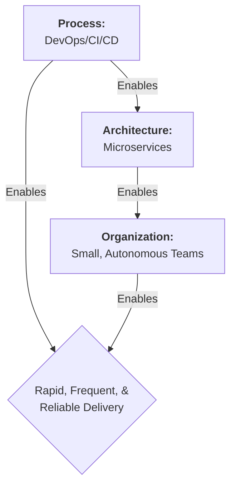

# 1.6 - Microservice Architecture Pattern Language

### 1. යෙදුමක් සේවා වලට වෙන් කිරීමේ රටා (Patterns for Decomposing)

ලොකු Monolithic application එකක් කුඩා සේවා (services) වලට කඩන්නේ කොහොමද කියන එක ලොකුම අභියෝගයක්. මේකට ප්‍රධාන ක්‍රම දෙකක් තියෙනවා.

-   **Decompose by business capability (ව්‍යාපාරික හැකියාවන් අනුව වෙන් කිරීම):**
    මේ කියන්නේ application එකේ තියෙන ප්‍රධාන ව්‍යාපාරික කොටස් අනුව සේවා වෙන් කරන එක.
    *   **උදාහරණය:** E-commerce system එකක් හදනවා නම්, Orders බලාගන්න එක සේවාවක් (Order Service), ගෙවීම් බලාගන්න තව සේවාවක් (Payment Service), සහ භාණ්ඩ තොගය බලාගන්න තවත් සේවාවක් (Inventory Service) විදියට වෙන් කරන්න පුළුවන්.

-   **Decompose by subdomain (උප-වසම් අනුව වෙන් කිරීම):**
    මේක Domain-Driven Design (DDD) මත පදනම් වූවක්. මෙහිදී, යෙදුමේ ප්‍රධාන ව්‍යාපාරික වසම (domain) කුඩා උප-වසම් (subdomains) වලට බෙදා, එක් එක් උප-වසම සඳහා වෙනම සේවාවක් නිර්මාණය කරනවා.

### 2. සන්නිවේදන රටා (Communication Patterns)

මයික්‍රොසර්විස් කියන්නේ එකිනෙකින් වෙන් වුණු, ස්වාධීන programs. ඉතින් මේවා එකිනෙක හා සන්නිවේදනය (communicate) කරන්නේ කොහොමද කියන එකටත් patterns තියෙනවා.

-   **Communication Style (සන්නිවේදන විලාසය):**
    *   **Remote Procedure Invocation (දුරස්ථ ක්‍රියා පටිපාටි ඇමතීම):** එක service එකක් අනිකට කෙලින්ම කතා කරනවා (request), අනිත් service එක දෙනකම් බලාගෙන ඉන්නවා. හරියට phone call එකක් වගේ.
    *   **Messaging (පණිවිඩ යැවීම):** එක service එකක් message queue එකකට පණිවිඩයක් දානවා. අනිත් service එක තමන්ට වෙලාව තියෙනකොට ඒ පණිවිඩය අරගෙන process කරනවා. හරියට email යවනවා වගේ.

-   **Discovery (සොයාගැනීම):**
    Service A එකට Service B එක්ක කතා කරන්න ඕන උනාම, Service B එකේ IP address එක මොකක්ද කියල හොයාගන්නේ කොහොමද? මේකට **Service Registry** එකක් පාවිච්චි කරනවා. ඒක හරියට services වලට තියෙන phone book එකක් වගේ. හැම service එකක්ම තමන්ගේ address එක මේකේ register කරනවා.

-   **External API (බාහිර API):**
    Mobile app එකක් හරි web app එකක් හරි අපේ services සිය ගාණක් එක්ක කෙලින්ම කතා කරන්නේ නෑ. ඒ වෙනුවට, අපි **API Gateway** එකක් පාවිච්චි කරනවා. ඒක තමයි අපේ system එකට තියෙන ප්‍රධාන දොරටුව. පිටතින් එන ඉල්ලීම් (requests) මුලින්ම එන්නේ Gateway එකට. Gateway එක තමයි ඒ ඉල්ලීම අදාළ service එකට යොමු කරන්නේ.

---

### 3. දත්ත අනුකූලතා රටා (Data Consistency Patterns)

හැම මයික්‍රොසර්විස් එකකටම තමන්ගේම database එකක් තියෙන නිසා, services කීපයක් හරහා යන transaction එකක් (උදා: order එකක් place කරනකොට Order DB එකයි Inventory DB එකයි දෙකම update වෙන්න ඕන) හරියට කළමනාකරණය කරන එක අභියෝගයක්.

-   **Saga Pattern:**
    මේක තමයි මේකට තියෙන ජනප්‍රියම විසඳුම. මෙතනදි වෙන්නේ, ලොකු transaction එකක්, කුඩා local transactions කීපයක අනුපිළිවෙලක් විදියට ක්‍රියාත්මක කරන එක. යම්කිසි step එකක් fail උනොත්, ඒකට කලින් සාර්ථක වෙච්ච steps ටික අහෝසි කරන්න **compensating transactions** ක්‍රියාත්මක කරනවා.
    *   **උදාහරණය:** සංචාරයක් book කරනවා හිතන්න (Flight, Hotel, Car).
        1.  Flight book කළා (සාර්ථකයි).
        2.  Hotel book කළා (සාර්ථකයි).
        3.  Car rental එක book කරන්න ගියාම fail උනා.
        4.  දැන් compensating transactions මගින් Hotel booking එක සහ Flight booking එක cancel කරනවා.

---

### 4. දත්ත විමසුම් රටා (Querying Patterns)

Services කීපයක databases වල පැතිරිලා තියෙන දත්ත එකතු කරලා query එකක් run කරන්නේ කොහොමද?

-   **API Composition:**
    මේකෙදි වෙන්නේ, එක service එකක් (උදා: API Gateway) අනිත් services කීපයකට කතා කරලා, ඒවගෙන් එන දත්ත එකතු කරලා (aggregate), ප්‍රතිඵලය හදලා client ට දෙන එක.

-   **Command Query Responsibility Segregation (CQRS):**
    මේකෙදි, දත්ත ලියන (write/command) operations සහ දත්ත කියවන (read/query) operations දෙක වෙන් කරනවා. Query සඳහාම වෙනම, optimize කරපු read-only database එකක් පවත්වාගෙන යනවා.

---

### 5. නිරීක්ෂණ රටා (Observability Patterns)

Services ගොඩක් තියෙනකොට, system එකේ මොකක්හරි ප්‍රශ්නයක් ආවම ඒක හොයාගන්න එක (troubleshooting) අමාරුයි. Request එකක් services කීපයක් හරහා යන නිසා, කොතනද ප්‍රශ්නේ උනේ කියල හොයාගන්න බෑ.

-   **Log Aggregation:** හැම service එකකින්ම එන logs එක තැනකට (centralized logging server) එකතු කරනවා.
-   **Distributed Tracing:** එළියෙන් එන හැම request එකකටම unique ID එකක් (trace ID) දෙනවා. ඒ request එක යන හැම service එකකම log එකට ඒ ID එක දානවා. හරියට courier package එකක tracking number එක වගේ. මේ නිසා request එකේ සම්පූර්ණ ගමන් මගම බලාගන්න පුළුවන්.
-   **Health Check API:** හැම service එකක්ම `/health` වගේ endpoint එකක් expose කරනවා. මේකට call කරාම, service එක හොඳින් ක්‍රියාත්මක වෙනවද නැද්ද කියල දැනගන්න පුළුවන්.

---

### 6. ආරක්ෂක රටා (Security Patterns)

-   **Access Token Pattern:**
    User කෙනෙක් login උනාම, API Gateway එකෙන් user ට **Access Token** එකක් (JWT වගේ) දෙනවා. User යවන හැම request එකකම මේ token එක අමුණලා යවනවා. අනිත් services වලට පුළුවන් මේ token එක verify කරලා user කවුද, එයාට මොනවද කරන්න අවසර තියෙන්නේ කියල බලාගන්න. ඒක හරියට digital ID card එකක් වගේ.

---

### 7. සේවා Deploy කිරීමේ රටා (Service Deployment Patterns)

Monolithic යෙදුමක් deploy කිරීම සරලයි; ඇත්තේ එකම යෙදුමකි. Load balancer එකක් පිටුපස එහි instances කිහිපයක් ක්‍රියාත්මක කරයි. නමුත් මයික්‍රොසර්විස් යෙදුමක් deploy කිරීම වඩාත් සංකීර්ණයි. විවිධ භාෂා සහ රාමු (frameworks) වලින් ලියන ලද සේවා සිය ගණනක් තිබිය හැකියි.

-   **Traditional Deployment:** WAR ගොනු වැනි භාෂා-විශේෂිත පැකේජ ක්‍රම මයික්‍රොසර්විස් සඳහා සුදුසු නැත.
-   **Modern Deployment:** අපට ඉහළ ස්වයංක්‍රීයකරණයක් සහිත deployment platform එකක් අවශ්‍යයි. ප්‍රධාන ක්‍රම තුනකි:
    -   **Service-per-VM:** එක් එක් සේවාව වෙනම Virtual Machine එකක ක්‍රියාත්මක කිරීම.
    -   **Service-per-Container:** එක් එක් සේවාව වෙනම Container (උදා: Docker) එකක ක්‍රියාත්මක කිරීම. මෙය වඩාත් ජනප්‍රිය සහ කාර්යක්ෂම ක්‍රමයයි.
    -   **Serverless Deployment:** කේතය පමණක් upload කරන අතර, AWS Lambda වැනි platform එකක් මඟින් යටිතල පහසුකම් (infrastructure) කළමනාකරණය කරයි.

---

### 8. ස්වයංක්‍රීය පරීක්ෂණ රටා (Automated Testing Patterns)

මයික්‍රොසර්විස් ගෘහ නිර්මාණ ශිල්පය නිසා තනි සේවාවක් පරීක්ෂා කිරීම පහසුය. නමුත්, සියලුම සේවා එකට ක්‍රියා කරනවාදැයි පරීක්ෂා කරන සංකීර්ණ, මන්දගාමී සහ පහසුවෙන් බිඳෙන සුළු (brittle) end-to-end පරීක්ෂණ වලින් වැළකී සිටීම වැදගත් වේ.

-   **Consumer-Driven Contract Test:** සේවාවක්, එය භාවිතා කරන client (consumer) ගේ අවශ්‍යතා (contract) සපුරාලන්නේදැයි තහවුරු කරයි.
-   **Service Component Test:** එක් සේවාවක් අනෙක් සේවා වලින් හුදකලා කර (in isolation) පරීක්ෂා කිරීම.

---

### 9. හරස් කැපුම් ගැටළු සඳහා රටා (Patterns for Cross-Cutting Concerns)

සෑම සේවාවකටම ක්‍රියාත්මක කිරීමට අවශ්‍ය වන පොදු කාර්යයන් (concerns) ඇත.

-   **Externalized Configuration:** Database credentials වැනි configuration දත්ත කේතයෙන් පිටත (උදා: config server, environment variables) තබා කළමනාකරණය කිරීම.
-   **Microservice Chassis:** මෙම පොදු කාර්යයන් (logging, health checks, metrics) ඇතුළත් මූලික රාමුවක් (framework) නිර්මාණය කිරීම. නව සේවා ගොඩනගන්නේ මෙම "chassis" එක මතයි. ಇದರಿಂದಾಗಿ එකම දේ නැවත නැවතත් ලිවීම අවශ්‍ය නොවේ.

---

### 10. මයික්‍රොසර්විස් වලින් එහාට: ක්‍රියාවලිය සහ සංවිධානය

සාර්ථක මෘදුකාංගයක් සඳහා නිවැරදි ගෘහ නිර්මාණ ශිල්පය (architecture) පමණක් ප්‍රමාණවත් නොවේ. එයට ගැලපෙන ආයතනික ව්‍යුහයක් සහ ක්‍රියාවලියක්ද අත්‍යවශ්‍ය වේ.

-   **Organization (සංවිධානය):**
    විශාල කණ්ඩායම් වෙනුවට, කුඩා (8-12), ස්වාධීන, සහ විවිධ හැකියාවන්ගෙන් යුතු (cross-functional) කණ්ඩායම් වලට බෙදී වැඩ කිරීම. එක් කණ්ඩායමක්, නිශ්චිත ව්‍යාපාරික හැකියාවකට අදාළ සේවා කිහිපයක් නිර්මාණය කිරීමේ සිට ක්‍රියාත්මක කිරීම දක්වා සම්පූර්ණ වගකීම ගනී ("You build it, you run it").

-   **Process (ක්‍රියාවලිය):**
    **DevOps** සහ **Continuous Delivery/Deployment (CI/CD)** වැනි ක්‍රියාවලි අනුගමනය කිරීම. මින් අදහස් කරන්නේ මෘදුකාංග නිර්මාණය, පරීක්ෂා කිරීම සහ නිකුත් කිරීමේ ක්‍රියාවලිය සම්පූර්ණයෙන්ම ස්වයංක්‍රීයකරණය කිරීමයි.

මෙම අංග තුන (Architecture, Organization, Process) එකට එකතු වූ විට, විශාල, සංකීර්ණ යෙදුම් වේගවත්ව, නිරතුරුව සහ විශ්වාසවන්තව ලබා දීමට හැකි වේ.

---

### සාරාංශය (Summary)
-   **Pattern Language** කියන්නේ පොදු ගැටළු වලට තියෙන හොඳම විසඳුම් එකතුවක්.
-   **Decomposition:** Application එකක් කුඩා සේවා වලට කඩන්න Business Capability වගේ ක්‍රම පාවිච්චි කරනවා.
-   **Communication:** Services අතර සන්නිවේදනයට API Gateway, Service Registry වගේ දේවල් අත්‍යවශ්‍යයි.
-   **Data Consistency:** Services කීපයක් හරහා යන transactions වලට Saga pattern එක හොඳ විසඳුමක්.
-   **Observability:** Distributed Tracing, Log Aggregation නැතුව මයික්‍රොසර්විස් වල ප්‍රශ්න හොයන්න ගොඩක් අමාරුයි.
-   **Deployment:** Containers සහ Serverless වැනි නවීන, ස්වයංක්‍රීය ක්‍රම අත්‍යවශ්‍යයි.
-   **Testing:** සේවා හුදකලාව පරීක්ෂා කිරීම (Component Tests) සහ Contract Tests වැදගත්.
-   **Process & Organization:** සාර්ථකත්වය සඳහා Microservice Architecture එකට අමතරව DevOps ක්‍රියාවලි සහ කුඩා, ස්වාධීන කණ්ඩායම් අවශ්‍යයි.
-   **Security:** API Gateway එක හරහා user authentication කරලා, Access Tokens පාවිච්චි කරන එක සුලභ ක්‍රමයක්.